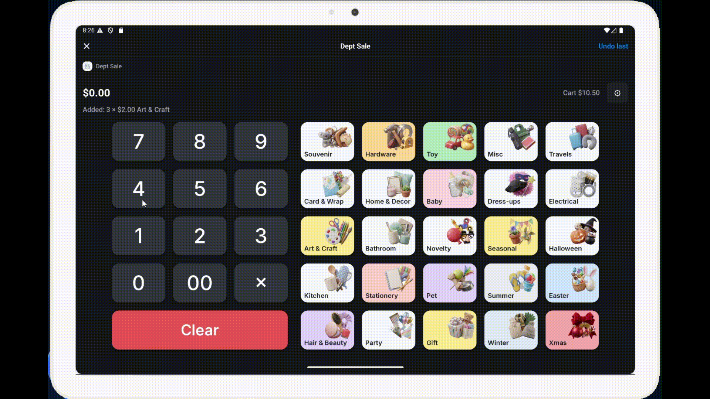
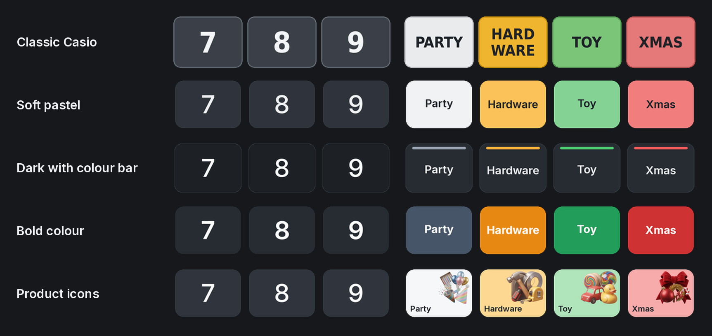

# Dept Sale


A Shopify POS extension that gives the till a Casio-style department keypad.
Type a price, press a department, and the item goes into the cart.

We built this for Price Savers, a party and souvenir shop in West Lakes, South
Australia, when we moved off an old Casio cash register and onto Shopify POS.
Most of the stock has barcodes, but plenty doesn't: loose novelties, seasonal
lines, things with a torn label. On the Casio, staff rang those up with `450`
then `PARTY`. On Shopify POS the same item means opening *Custom sale*, typing
the price, tapping into the title field, typing a name on the on-screen
keyboard and hitting Save. That's fine once. With a queue out the door it isn't.

Dept Sale puts the Casio's 25 department keys back, in the same positions, as a
tile on the POS home screen.

<p align="center">
  
</p>

## How staff use it

| Keys | Result |
| --- | --- |
| `450` → **Party** | 1 × $4.50 Party |
| `3` **×** `450` → **Party** | 3 × $4.50 Party |
| **Party** again, nothing typed | Repeats the last Party price |
| **Clear** | Clears the price and resets the quantity to 1 |
| **Undo last** (top right) | Takes the last item back out of the cart |

Prices are keyed in cents with no decimal point, same as the old till: `5` is
$0.05, `1000` (or `10` `00`) is $10.00. Pressing a department with no price
typed, when it isn't the same department as the last sale, shows *Type a price
first* instead of adding anything.

After each sale, a green pill under the price confirms what went in. If POS
really couldn't add an item, the pill turns red and a message asks staff to
key it again. Items are saved in the background, so staff can start typing the
next price straight away.

## What it does

- **Same layout as the Casio.** 25 department keys in a 5 × 5 grid, with the
  number pad beside them on a tablet or above them on a phone.
- **Five key styles.** Classic Casio, Soft pastel, Dark with colour bar, Bold
  colour, and Product icons (tablets only; phones fall back to Soft pastel).
  Pick one from the ⚙ button. Each till remembers its own choice.

  <p align="center">
    
  </p>

- **Works without internet.** The keys are pictures loaded from Shopify Files.
  When POS reports that the internet has dropped, every key switches to a
  plain button, so the keypad keeps working. The pictures come back when the
  connection does.
- **Department tagging.** Each line gets a hidden `_ps_dept` property (for
  example `PARTY`). Customers and receipts don't show it, but it's on the order
  in admin and in exports, which is enough to build department totals.
- **Guard rails.** A single key-in is capped at $999.99 and quantities at 99,
  so an extra zero doesn't slip through unnoticed.

## Setup

You'll need Node 20+, the [Shopify CLI](https://shopify.dev/docs/api/shopify-cli)
(3.92 or later) and a Shopify account that can create apps for your store.

```bash
npm install
shopify app config link   # connect the project to your own app
shopify app dev           # preview on a development store
```

With `shopify app dev` running, open the Dev Console (`p`), find the
**dept-sale** row and open its **Mobile** preview link on a device that's
logged in to the development store in Shopify POS. On an Android emulator it's
quickest to push the link straight in:

```bash
adb shell am start -a android.intent.action.VIEW -d "PASTE_PREVIEW_LINK"
```

Then add the tile: POS home screen → **Edit** → **Add tile** → **Apps** →
**Dept Sale**.

### Going live

```bash
shopify app deploy
```

In the Dev Dashboard, open the app, choose **Custom distribution**, enter your
store's `.myshopify.com` domain and install the app from the link it generates.
Later deploys go to the store automatically, and tills pick them up the next
time POS reloads.

If staff can't see the tile, give their POS role access to apps under
**Settings → Users and permissions → POS roles**.

## Picture keys

Without pictures, the keys are standard POS buttons and everything still works.
To turn on the styled keys:

1. Upload everything in `key-images/` to **Shopify admin → Content → Files**.
   Don't rename anything. If a file with the same name already exists, Shopify
   saves the new one as `name_1.png` and that key will fall back to a button.
2. Copy the URL of any uploaded file and paste everything up to and including
   `/files/` into `KEY_IMAGES.baseUrl` in
   `extensions/dept-sale/src/departments.js`.
3. Deploy.

The pictures are generated, not drawn by hand. To change a colour, label or
style, edit `tools/make_keys.py` and run it:

```bash
pip install pillow
python3 tools/make_keys.py
```

After replacing images in Shopify Files, bump `KEY_IMAGES.version` so tills
fetch the new ones instead of showing cached copies.

The Product icons style uses AI-generated product pictures (one per department,
on a white background) kept in `icon-sources/`. To change one, replace
`icon-sources/icon-<department>.png` and run:

```bash
pip install "rembg[cpu]"
python3 tools/cut_icons.py hardware     # cuts out the background -> icon-cutouts/
python3 tools/make_keys.py icons        # rebuilds only the Product icons keys
```

## Changing departments

Everything a shop would want to change is in
`extensions/dept-sale/src/departments.js`:

- `DEPARTMENT_ROWS` holds the keys, in till order. For each one, `label` is
  the text on a tablet key, `short` is the text on a phone key, and `title` is
  what shows in the cart and on the receipt. Set `taxable: false` for a
  GST-free department.
- `MAX_PRICE_CENTS` and `MAX_QTY` set the guard rails.
- `LAYOUT` sets the key sizes for tablets and phones.
- `STYLES` and `DEFAULT_STYLE` set the key styles.

If you add or rename a department and use picture keys, add it to `DEPTS` in
`tools/make_keys.py` too and regenerate the images.

## Project layout

```
extensions/dept-sale/
  shopify.extension.toml
  src/
    Tile.jsx            home screen tile
    Modal.jsx           the keypad screen
    departments.js      departments, layout, styles, picture settings
    keypad.js           keypad logic (no Shopify calls)
    imageProbe.js       checks which picture keys load
    *.test.js           tests
tools/
  make_keys.py          generates key-images/ (python3 tools/make_keys.py [style])
  cut_icons.py          removes icon backgrounds: icon-sources/ -> icon-cutouts/
  rename_icons.py       renames downloaded icons to icon-<department>
  fonts/                Inter (SIL Open Font License)
icon-sources/           product pictures for the Product icons style
icon-cutouts/           the same with transparent backgrounds
key-images/             generated PNGs to upload to Shopify Files
```

## Tests

The keypad logic and the picture check are plain JavaScript, so they run under
Node without POS:

```bash
node --test extensions/dept-sale/src/keypad.test.js extensions/dept-sale/src/imageProbe.test.js
```

## Known limits

These come from what POS extensions are allowed to do, not from choices in
this code.

- **No haptics or sound.** POS extensions can't vibrate the device or play a
  sound. Feedback is visual only.
- **Small price text.** POS doesn't let extensions set text size, so the price
  display uses the largest heading POS offers.
- **Scanning while the keypad is open.** Barcode scans may not reach the cart
  while Dept Sale is on screen. Close it to scan, and reopen it for the next
  unlabelled item.
- **Repeat sales can merge.** POS sometimes merges a repeated custom sale into
  the existing line (Party ×3) and reports an error even though the item went
  in. Dept Sale checks the cart before showing an error, and Undo takes off one
  at a time.
- **Missing pictures aren't detected.** Shopify's file server doesn't let an
  extension check whether a file exists, so a picture that was never uploaded
  (or was renamed on upload) shows as a broken image instead of falling back to
  a button. After uploading, open Dept Sale once and check every key.
- **Custom sales in reports.** Custom sales don't show up in product reports
  the way catalogue products do. The `_ps_dept` property is there for
  department totals, but check how your reports treat these lines before you
  rely on them.

## License

Apache-2.0. Inter is included under the SIL Open Font License; see
`tools/fonts/Inter-LICENSE.txt`.
